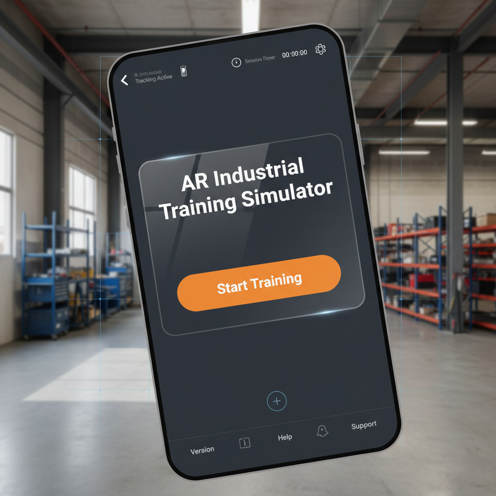
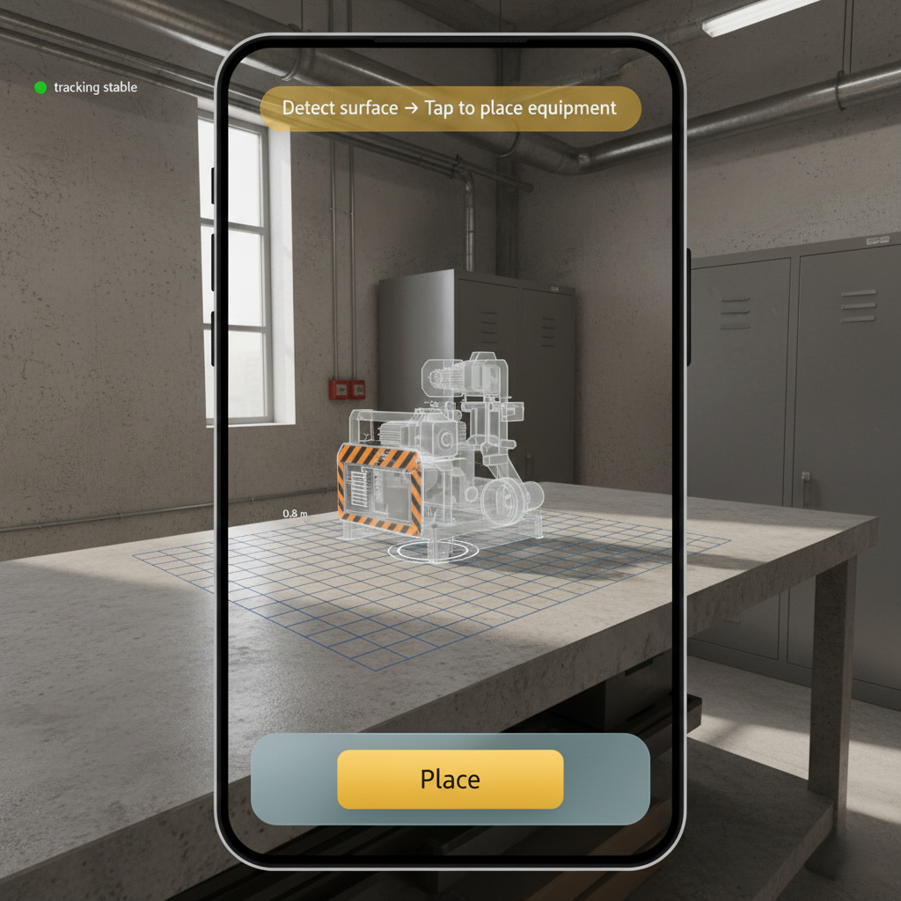
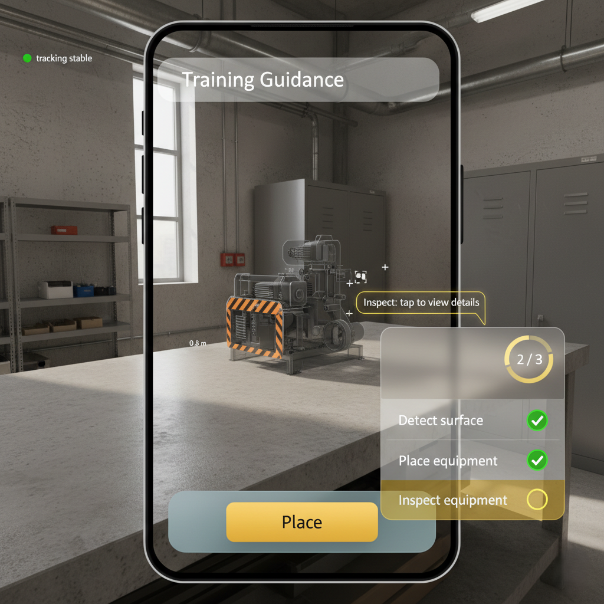
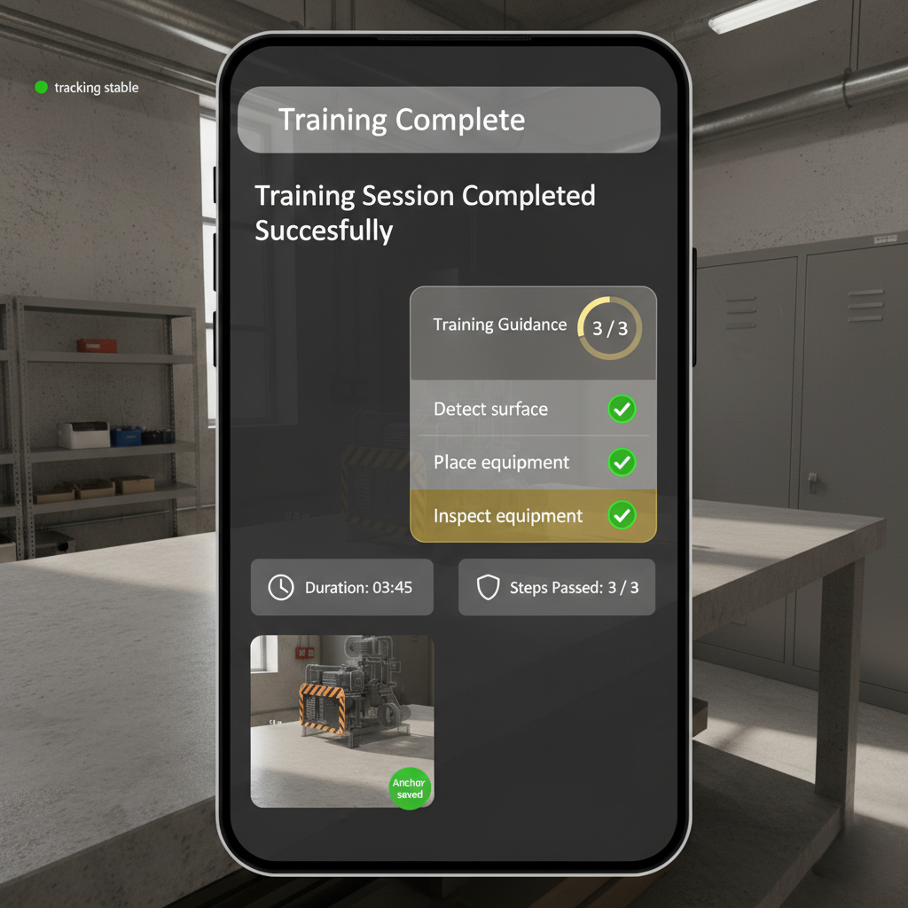

# AR Industrial Training Simulator — Gallery

This gallery contains in-app mockups demonstrating the main training flow used in the project: welcome, placement, validation, and completed screens.

---

Open the images at `docs/screenshots/` for full-resolution assets.
